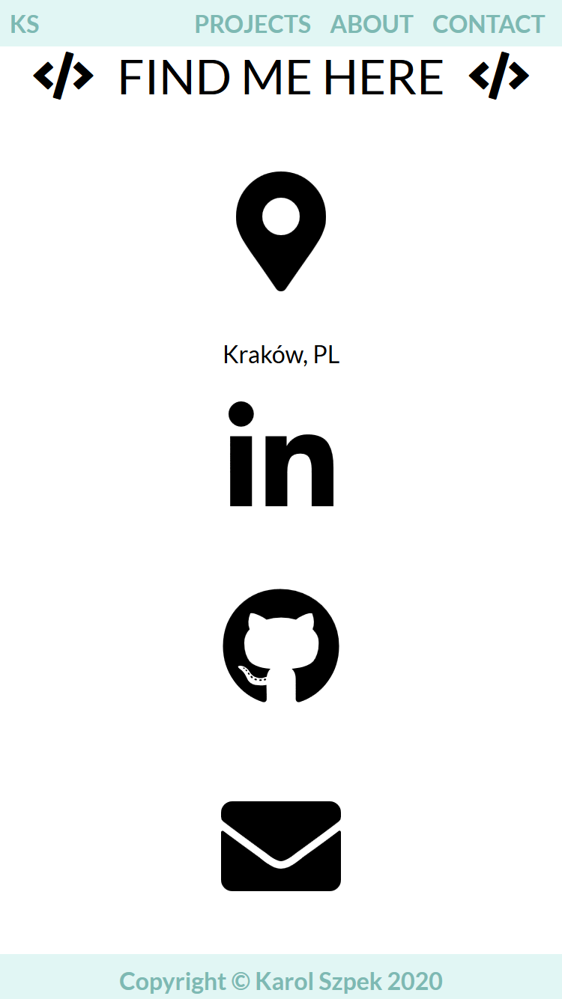

My portfolio website containing all project I have made. 

I used many techniques to provide good user experience, e.g. calm colours and design, flexbox, 
popup modal galleries (with screenshots and describtions of the projects), jQuery smooth effects 
to scroll the page and to change size of the navigation bar. 

The page is fully responsive, it works properly on tablets and mobile phones.

1. Popup gallery modal - desktop view

2. Projects - tablet landscape view

3. Projects - tablet portrait view

4. Contact info - mobile phone landscape view

5. Contact info - mobile phone portrait view

